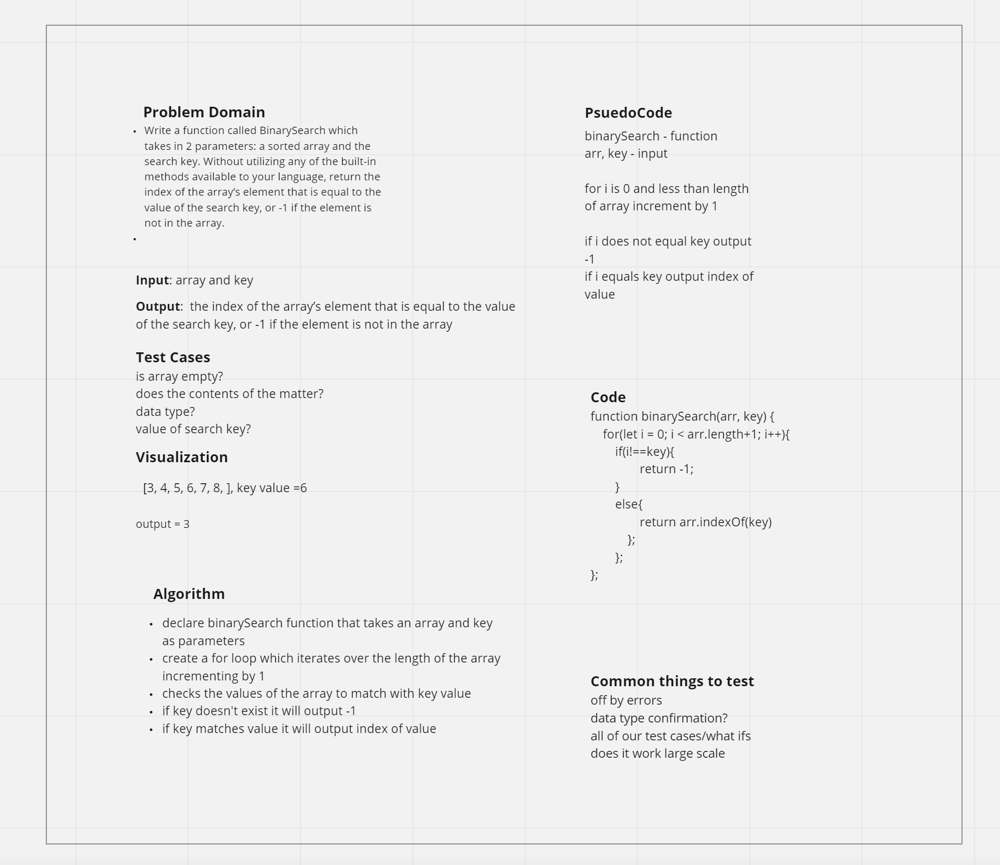

# Binary Search of Sorted Array

Write a function called BinarySearch which takes in 2 parameters: a sorted array and the search key. Without utilizing any of the built-in methods available to your language, return the index of the array’s element that is equal to the value of the search key, or -1 if the element is not in the array.

## Whiteboard Process

## Approach & Efficiency

My approach to this code challenge was to use a for loop to iterate over the array and output either -1 or the index of the key value.

Big O for this problem is time: O(n) space: O(1)
