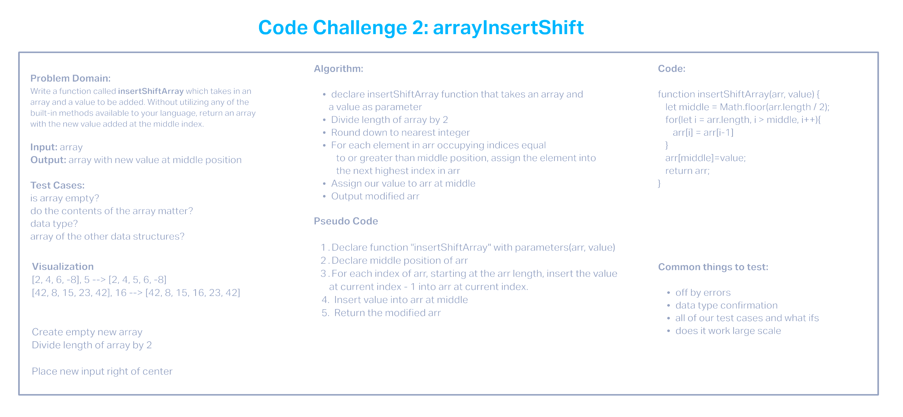

# Insert to Middle of an Array

Write a function called insertShiftArray which takes in an array and a value to be added. Without utilizing any of the built-in methods available to your language, return an array with the new value added at the middle index.

## Whiteboard Process

## Approach & Efficiency

I worked with Tyler Main on this our appoach was to divide the array by 2 to work with the middle and insert our value.
Big O is still unclear to me but I believe Time and Space is O(n)
