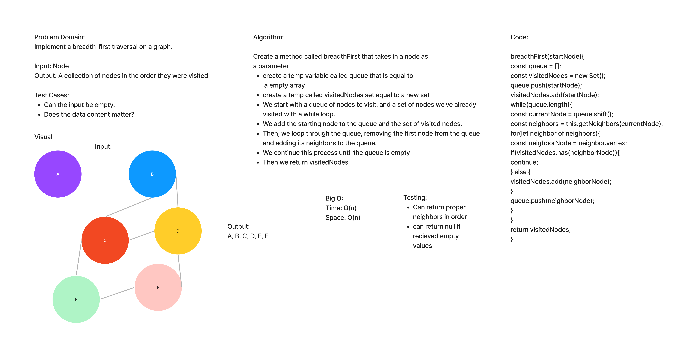

# Breadth First

## Credit/ Collab

Worked on whiteboard with Tyler Main and used demo code from Friday for actual code.

## Challenge

- Implement a breadth-first traversal on a graph.

## Approach & Efficiency

- Utilized the Single-responsibility principle: methods are clean, reusable, abstract component parts to the whole challenge.
- Extending an Implementation
- Big O for this problem is time: O(n) space: O(n)

## API

- Arguments: Node
- Returns: Return: A collection of nodes in the order they were visited.
- Display the collection

## Whiteboard

