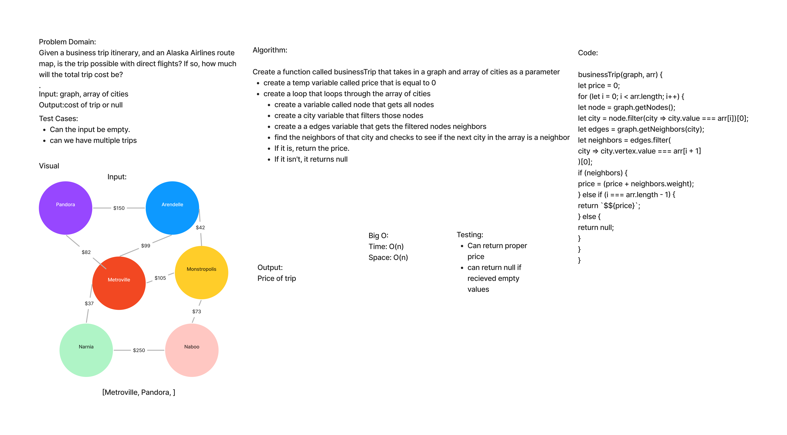

# Business Trip

## Challenge

- Given a business trip itinerary, and an Alaska Airlines route map, is the trip possible with direct flights? If so, how much will the total trip cost be?

## Approach & Efficiency

- Utilized the Single-responsibility principle: methods are clean, reusable, abstract component parts to the whole challenge.
- Extending an Implementation
- Big O for this problem is time: O(n) space: O(n)

## API

- Arguments: Graph and array of cities
- Returns: the cost of the trip (if it’s possible) or null (if not)
- Display the collection

## Whiteboard

