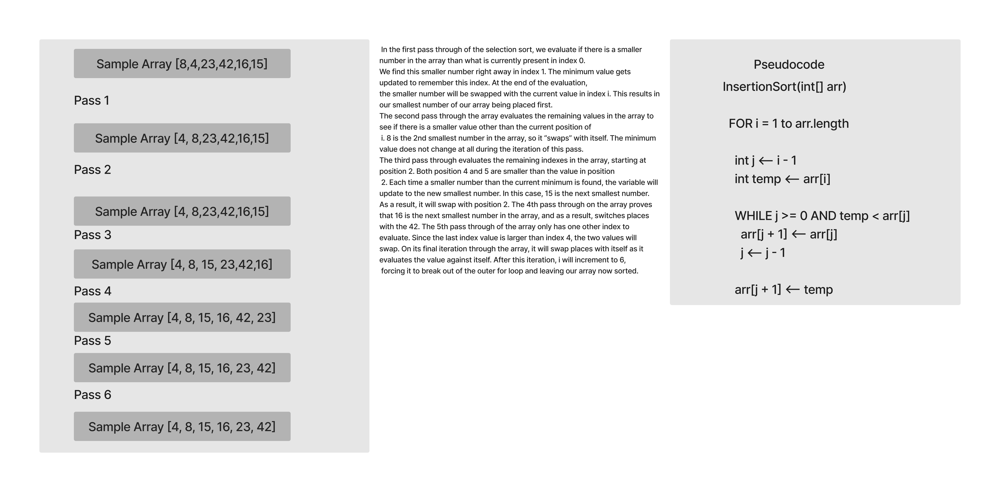

# Challenge Summary

Insertion Sort

## Code Blog Image

## Approach & Efficiency

## Approach

Review the pseudocode below, then trace the algorithm by stepping through the process with the provided sample array. Document your explanation by creating a blog article that shows the step-by-step output after each iteration through some sort of visual.

## Efficiency

Time: O(n^2)
Space: O(1)

## Credit

Taylor Main, Example Document