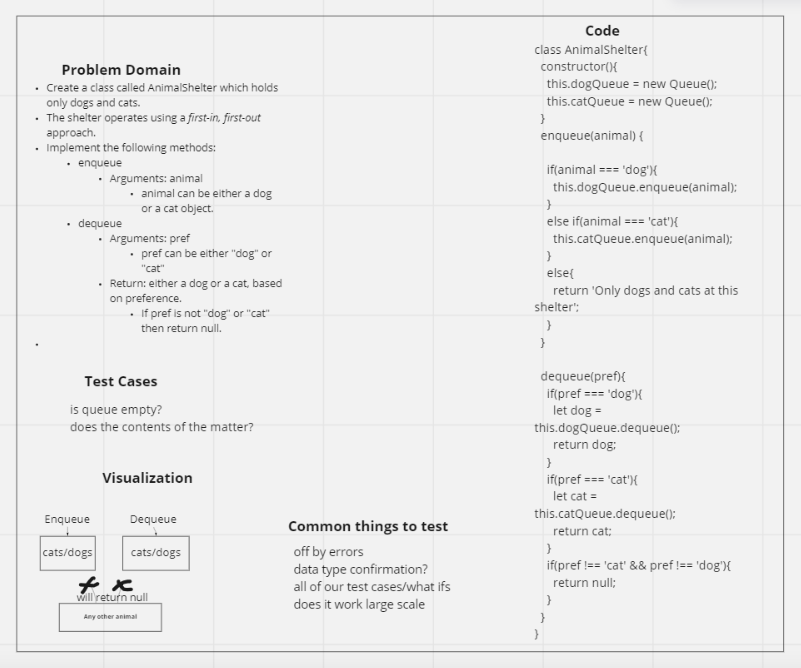

# Animal Shelter

## Partner

Worked on this with Brandon Pitts

## Challenge

- Extending an Implementation
- Implement a Stack Queue Animal Shelter

## WHITE BOARD IMAGE

## Approach & Efficiency

- Create a class called AnimalShelter which holds only dogs and cats.
- The shelter operates using a first-in, first-out approach.
- Big O for this problem is time: O(n) space: O(1)

## API

### Pseudo

### Enqueue

- Arguments: animal
- Animal can be either a dog or a cat object.

### dequeue

- Arguments: pref
- Pref can be either "dog" or "cat"
- Returns: either a dog or a cat, based on preference.
- If pref is not "dog" or "cat" then return null.
