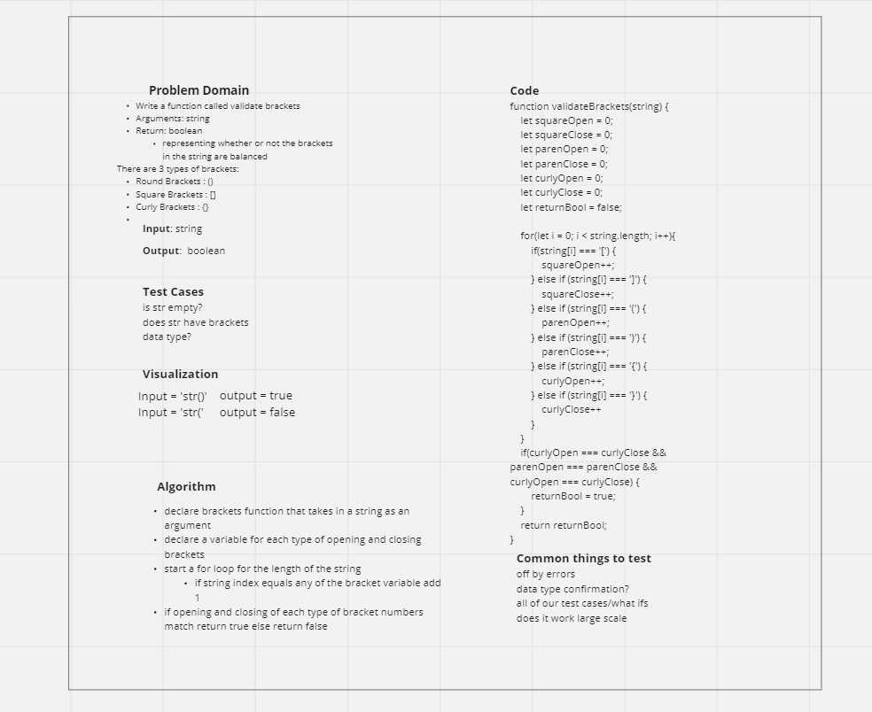

# Brackets

## Partner

Worked on this with Isaiah Keller

## Challenge

- Extending an Implementation
- Implement a function called validate bracket

## WHITE BOARD IMAGE

## Approach & Efficiency

- Write a function called validate brackets
- Arguments: string
- Return: boolean representing whether or not the brackets in the string are balanced

## API

### There are 3 types of brackets:

- Round Brackets : ()
- Square Brackets : []
- Curly Brackets : {}
