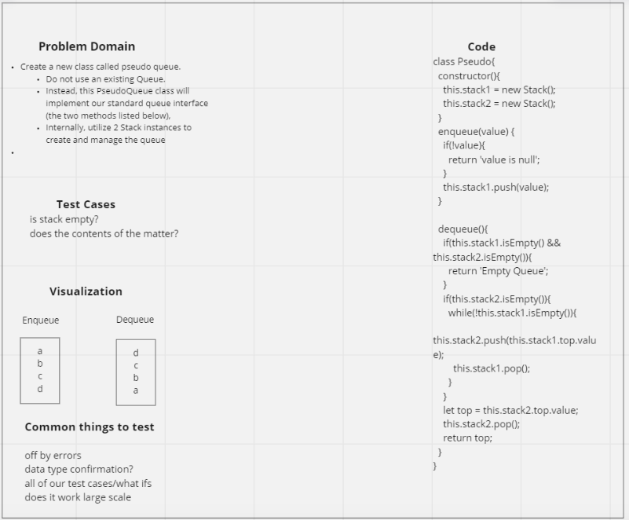

# Pseudo Queue

## Challenge

- Extending an Implementation
- Implement a Pseudo Queue

## WHITE BOARD IMAGE

## Approach & Efficiency

- Create a new class called pseudo queue
- Do not use an existing Queue.
- Instead, this PseudoQueue class will implement our standard queue interface (the two methods listed below),
- Internally, utilize 2 Stack instances to create and manage the queue
- Big O for this problem is time: O(n) space: O(1)

## API

### Pseudo

### Enqueue

- Arguments: value
- Inserts value into the PseudoQueue, using a first-in, first-out approach.

### dequeue

- Arguments: none
- Extracts a value from the PseudoQueue, using a first-in, first-out approach.
