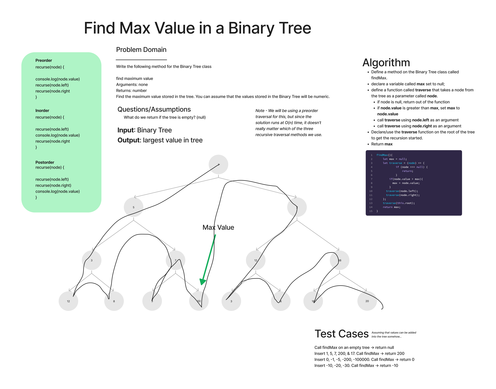

# Binary Trees

## Partner

Worked on this Robert Shepley

## Challenge

- Extending an Implementation
- Implement a Binary Tree method that finds the max value in the tree

## WHITE BOARD IMAGE

## Approach & Efficiency

- Create the following method for the Binary Tree class that finds the max value
- Big O for this problem is time: O(n)

## API

### Binary Tree

- pre order
- in order
- post order which returns an array of the values, ordered appropriately.

### Max Value

- Finds the maximum value stored in the tree
- Arguments: none
- Returns: number
.
